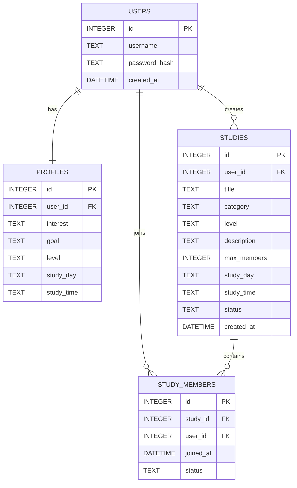

# Study Matching System (Backend)

대학생 스터디 모집 과정에서 발생하는 **목표 불일치**와 **모집 비효율 문제**를 해결하기 위한  
**웹 기반 스터디 매칭 시스템 MVP 백엔드**입니다.

본 시스템은 사용자가 로그인 후 자신의 관심분야, 학습 목표, 학습 수준, 원하는 학습 요일과 시간을 입력하고,  
이를 바탕으로 스터디를 생성하거나 조건에 맞는 스터디를 조회하여 참여 신청할 수 있도록 지원합니다.  
또한 스터디 생성자는 참여 신청을 승인 또는 거절할 수 있으며, 향후 자동 추천 및 매칭 기능으로 확장할 수 있도록 설계되었습니다.

---

## 프로젝트 개요

기존의 스터디 모집은 커뮤니티 게시글, 단체 채팅방, 지인 추천 등에 의존하는 경우가 많아  
사용자가 원하는 목표, 수준, 요일, 시간대가 일치하는 사람을 찾기 어렵습니다.

이로 인해 다음과 같은 문제가 발생합니다.

- 자신이 원하는 목표, 시간대가 일치하는 사람을 찾기 어렵다
- 관심 분야가 맞지 않는 경우가 많다
- 스터디 모집 및 관리 과정이 비효율적이다

본 프로젝트는 이러한 문제를 해결하기 위해  
**사용자 프로필 기반 스터디 생성 / 조회 / 참여 신청 / 승인·거절 기능**을 제공하는 웹 기반 시스템입니다.

---

## 시스템 목표

- 사용자 프로필 기반 스터디 모집 환경 제공
- 스터디 생성 및 모집 과정 단순화
- 스터디 관리 기능 제공
- 향후 자동 매칭 기능 확장을 위한 데이터 구조 설계

---

## 주요 기능

### 1. 회원 관리
- 회원가입
- 로그인

### 2. 사용자 프로필
- 관심분야 입력
- 학습 목표 입력
- 학습 수준 입력
- 원하는 공부 요일 입력
- 원하는 공부 시간 입력
- 프로필 정보 저장

### 3. 스터디 관리
- 스터디 생성
- 스터디 목록 조회
- 조건에 맞는 스터디 조회
- 스터디 참여 신청
- 스터디 생성자의 참여 신청 승인 및 거절
- 스터디 생성자의 참여자 목록 조회

---

## 시스템 아키텍처

본 시스템은 웹 기반 Client–Server 구조로 설계되었습니다.

### Client (Frontend)
- HTML
- CSS
- JavaScript
- 사용자 입력 처리
- API 요청 전송 및 응답 데이터 표시

### Server (Backend)
- Node.js
- Express
- REST API 서버
- 사용자 인증 처리
- 스터디 생성 및 조회 기능 제공
- 데이터베이스와 통신

### Database
- SQLite 기반 데이터 저장
- 사용자 정보, 프로필 정보, 스터디 정보 관리

### Architecture Diagram

User Browser  
↓  
Frontend (HTML / CSS / JS)  
↓ REST API  
Backend Server (Node.js / Express)  
↓  
SQLite Database

---

## 기술 스택

| 구분 | 기술 |
|------|------|
| Frontend | HTML, CSS, JavaScript |
| Backend | Node.js, Express |
| Database | SQLite |
| Deployment | Local environment |
| Source Repository | GitHub |

---

## 데이터베이스 구조

본 시스템은 다음 4개의 주요 테이블로 구성됩니다.

- `users` : 사용자 계정 정보
- `profiles` : 관심 분야, 학습 목표, 수준, 공부 요일, 공부 시간
- `studies` : 스터디 정보
- `study_members` : 스터디 참여 관계 정보

### 테이블 관계
- 한 명의 사용자는 하나의 프로필을 가진다
- 한 명의 사용자는 여러 개의 스터디를 생성할 수 있다
- 한 명의 사용자는 여러 개의 스터디 참여 정보를 가질 수 있다
- 하나의 스터디는 여러 명의 참여자를 가질 수 있다

### ERD



---

## 데이터 무결성 및 제약 조건

- 동일한 username은 중복 저장할 수 없다
- 한 명의 사용자에 대해 하나의 프로필만 저장할 수 있다
- 동일한 사용자는 같은 스터디에 중복으로 참여 신청할 수 없다
- `studies.max_members`는 1 이상의 값만 허용한다
- `studies.status`는 `recruiting` 또는 `closed` 값만 허용한다
- `study_members.status`는 `pending`, `approved`, `rejected` 값만 허용한다
- 모집 상태가 `closed`인 스터디에는 참여 신청 및 승인 처리를 할 수 없다
- 승인 인원은 모집 인원(`max_members`)을 초과할 수 없다

---

## 구현 특징

- JWT 기반 인증 구현
- 동일 사용자 중복 신청 방지 (UNIQUE + 로직)
- 상태 전이 제한 (pending만 변경 가능)
- 정원 초과 방지 로직

---

## 문제 해결

- 스터디 중복 신청 문제 → DB UNIQUE + 서버 검증으로 해결
- 권한 문제 → Owner만 승인 가능하도록 설계

---

## API 설계

### 인증 적용 기준

- `POST /api/register` : 인증 불필요
- `POST /api/login` : 인증 불필요
- `POST /api/profile` : 인증 필요
- `POST /api/studies` : 인증 필요
- `GET /api/studies` : 인증 불필요
- `POST /api/studies/:studyId/join` : 인증 필요
- `GET /api/studies/:studyId/members` : 인증 필요
- `PATCH /api/studies/:studyId/members/:userId` : 인증 필요

---

## 주요 API 예시

### 회원가입
**POST** `/api/register`

#### Request
```json
{
  "username": "user1",
  "password": "1234"
}

---

## 실행 방법

### 사전 요구
- Node.js: LTS
- SQLite는 `sqlite3` 라이브러리로 파일 DB를 사용하므로 별도 서버 설치 없이 동작합니다.
- `backend/database/schema.sql`이 존재해야 합니다. (서버 시작 시 schema를 읽어 DB 초기화)

### 설치/실행
```bash
cd backend
npm install
node src/server.js
