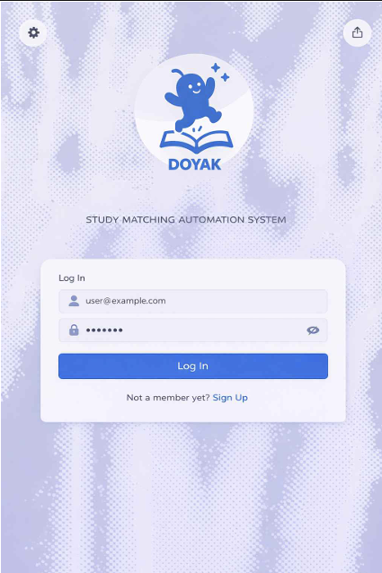
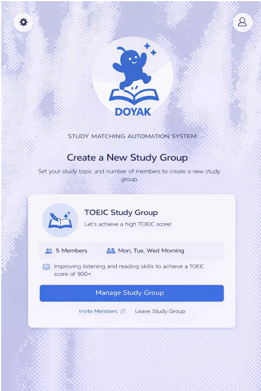
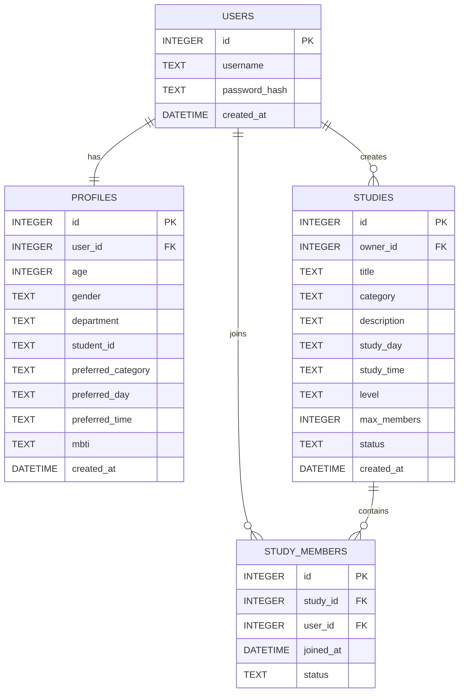
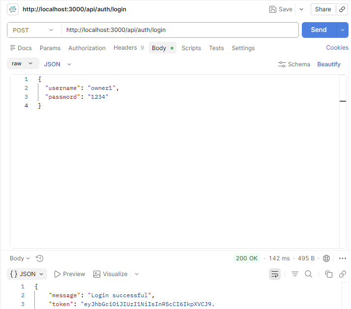
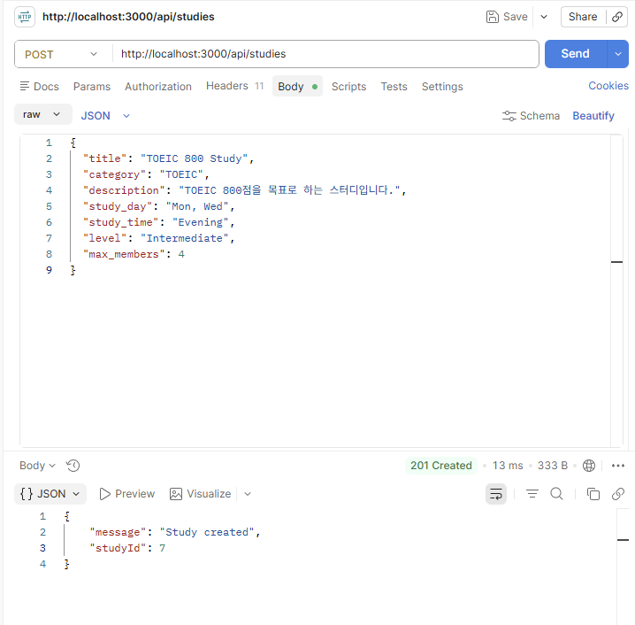
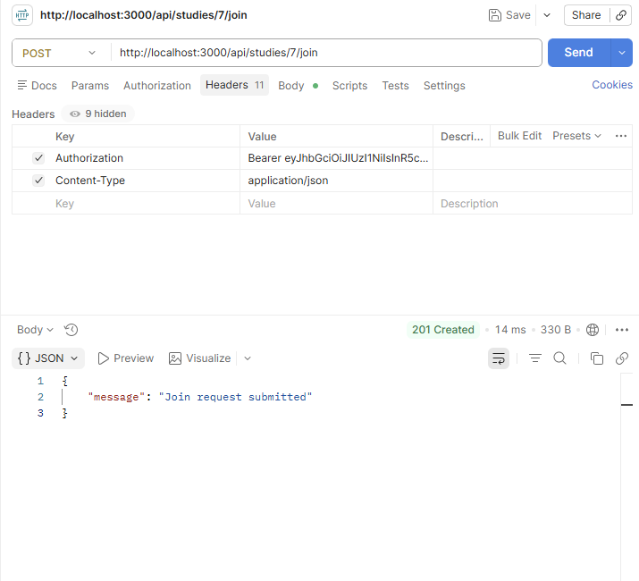
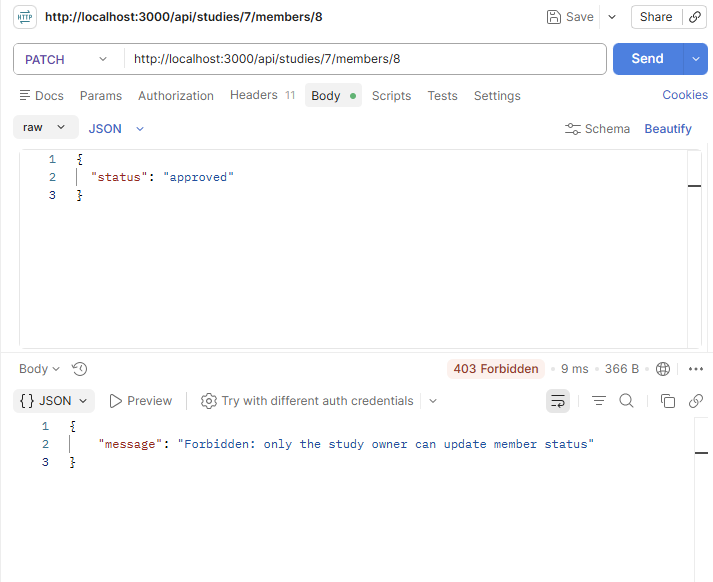
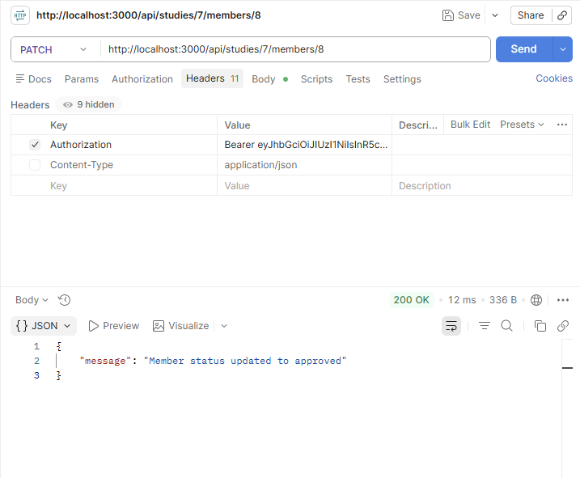

# Study Matching System

대학생 스터디 모집 과정에서 발생하는 목표 불일치와 모집 비효율 문제를 해결하기 위한  
**웹 기반 스터디 매칭 시스템 MVP 백엔드**입니다.

본 시스템은 사용자가 로그인 후 자신의 관심분야, 학습 목표, 학습 수준, 원하는 학습 요일과 시간을 입력하고,  
이를 바탕으로 스터디를 생성하거나 조건에 맞는 스터디를 조회하여 참여 신청할 수 있도록 지원합니다.  
또한 스터디 생성자는 참여 신청을 승인 또는 거절할 수 있으며, 향후 자동 추천 및 매칭 기능으로 확장할 수 있도록 설계되었습니다.

---

## 프로젝트 개요

기존의 스터디 모집은 커뮤니티 게시글, 단체 채팅방, 지인 추천 등에 의존하는 경우가 많아  
사용자가 원하는 목표, 수준, 요일, 시간대가 일치하는 사람을 찾기 어렵습니다.

이로 인해 다음과 같은 문제가 발생합니다.

- 자신이 원하는 목표, 시간대가 일치하는 사람을 찾기 어렵다
- 관심 분야가 맞지 않는 경우가 많다
- 스터디 모집 및 관리 과정에서 반복적인 참여자 확인 및 일정 조율로 인해 시간 소모가 크다

본 프로젝트는 이러한 문제를 해결하기 위해  
**사용자 프로필 기반 스터디 생성 / 조회 / 참여 신청 / 승인·거절 기능**을 제공하는 웹 기반 시스템입니다.

---

## 프로젝트 화면

아래 화면은 프로젝트 UI 설계 단계에서 제작한 화면입니다.
백엔드 기능은 해당 화면을 기준으로 구현되었습니다.

|화면|설명|
|----|----|
||로그인|
||스터디 정보 입력|
||스터디 생성 완료|

---

## 시스템 목표

- 사용자 프로필 기반 스터디 모집 환경 제공
- 스터디 생성 및 모집 과정 단순화
- 스터디 관리 기능 제공
- 향후 자동 매칭 기능 확장을 위한 데이터 구조 설계

---

## 구현 범위

✔ 회원가입

✔ 로그인

✔ JWT 인증

✔ 프로필 관리

✔ 스터디 생성

✔ 스터디 조회

✔ 참여 신청

✔ 승인/거절

❌ 자동 추천

❌ AI 매칭

(향후 확장 예정)

---

## Documents

- 📄 SRS : [SRS.md](docs/SRS.md)
- 📄 Design : [DESIGN.md](docs/DESIGN.md)

---

## 주요 기능

### 1. 회원 관리
- 회원가입
- 로그인

---

### 2. 사용자 프로필
- 관심분야 입력
- 학습 목표 입력
- 학습 수준 입력
- 원하는 공부 요일 입력
- 원하는 공부 시간 입력
- 프로필 정보 저장

---

### 3. 스터디 관리
- 스터디 생성
- 스터디 목록 조회
- 조건에 맞는 스터디 조회
- 스터디 참여 신청
- 스터디 생성자의 참여 신청 승인 및 거절
- 스터디 생성자의 참여자 목록 조회

## 실제 사용 흐름

1. 사용자는 회원가입 후 로그인한다.
2. 로그인한 사용자는 자신의 관심 분야, 목표, 수준, 요일, 시간대를 프로필에 저장한다.
3. 사용자는 스터디를 생성하거나 조건에 맞는 스터디를 조회한다.
4. 다른 사용자는 원하는 스터디에 참여 신청을 한다.
5. 스터디 생성자는 신청 목록을 확인하고 승인 또는 거절한다.
6. 승인 인원이 모집 정원에 도달하면 추가 승인 처리가 제한된다.

## 시스템 아키텍처

본 시스템은 웹 기반 Client–Server 구조로 설계되었습니다.

### Client (Frontend)
- HTML
- CSS
- JavaScript
- 사용자 입력 처리
- API 요청 전송 및 응답 데이터 표시

---

### Server (Backend)
- Node.js
- Express
- REST API 서버
- 사용자 인증 처리
- 스터디 생성 및 조회 기능 제공
- 데이터베이스와 통신

---

### Database
- SQLite 기반 데이터 저장
- 사용자 정보, 프로필 정보, 스터디 정보 관리

---

### Architecture Diagram

```Mermaid

User Browser  
↓  
Frontend (HTML / CSS / JS)  
↓ REST API  
Backend Server (Node.js / Express)  
↓  
SQLite Database

```

## 기술 스택

| 구분 | 기술 |
|------|------|
| Frontend | HTML, CSS, JavaScript |
| Backend | Node.js, Express |
| Database | SQLite |
| Deployment | Local environment |
| Source Repository | GitHub |

---

## 데이터베이스 구조

본 시스템은 다음 4개의 주요 테이블로 구성됩니다.

- `users` : 사용자 계정 정보
- `profiles` : 관심 분야, 학습 목표, 수준, 공부 요일, 공부 시간
- `studies` : 스터디 정보
- `study_members` : 스터디 참여 관계 정보

### 테이블 관계
- 한 명의 사용자는 하나의 프로필을 가진다
- 한 명의 사용자는 여러 개의 스터디를 생성할 수 있다
- 한 명의 사용자는 여러 개의 스터디 참여 정보를 가질 수 있다
- 하나의 스터디는 여러 명의 참여자를 가질 수 있다

### ERD



## 데이터 무결성 및 제약 조건

- 동일한 username은 중복 저장할 수 없다
- 한 명의 사용자에 대해 하나의 프로필만 저장할 수 있다
- 동일한 사용자는 같은 스터디에 중복으로 참여 신청할 수 없다
- `studies.max_members`는 1 이상의 값만 허용한다
- `studies.status`는 `recruiting` 또는 `closed` 값만 허용한다
- `study_members.status`는 `pending`, `approved`, `rejected` 값만 허용한다
- 모집 상태가 `closed`인 스터디에는 참여 신청 및 승인 처리를 할 수 없다
- 승인 인원은 모집 인원(`max_members`)을 초과할 수 없다

## 인증 흐름

로그인 → JWT 발급 → Authorization Header 포함 → 인증 필요 API 호출

## 구현 특징

- JWT 기반 인증을 적용하여 인증이 필요한 API 접근을 제어
- study_members (study_id, user_id) UNIQUE 제약 + 서버 검증으로 중복 신청 방지
- 상태 전이 제한을 통해 pending → approved/rejected 흐름 강제
- 승인 인원 max_members 초과 방지 로직 구현

## 문제 해결

- 스터디 중복 신청 문제 → DB UNIQUE + 서버 검증으로 해결
- 권한 문제 → Owner만 승인 가능하도록 설계

## API 테스트 화면

Postman을 사용하여 회원가입, 로그인, JWT 인증, 스터디 생성, 참여 신청, 권한 검증, 참여 승인 흐름을 테스트했습니다.
전체 API 테스트 캡처는 [`docs/postman`](docs/postman) 폴더에서 확인할 수 있습니다.

### 주요 API 테스트 흐름

| 기능           | 설명                                 | 테스트 화면                                                           |
| ------------ | ---------------------------------- | ---------------------------------------------------------------- |
| 로그인 및 JWT 발급 | 사용자 로그인 성공 후 JWT 토큰이 발급되는지 확인      |       |
| 스터디 생성       | 인증된 사용자가 스터디를 생성할 수 있는지 확인         |          |
| 스터디 참여 신청    | 다른 사용자가 모집 중인 스터디에 참여 신청할 수 있는지 확인 |          |
| 권한 검증        | 스터디 생성자가 아닌 사용자의 승인 요청이 차단되는지 확인   |  |
| 참여 승인        | 스터디 생성자가 참여 신청을 승인할 수 있는지 확인       |        |

### 전체 테스트 시나리오

1. 생성자 계정 회원가입
2. 참여자 계정 회원가입
3. 생성자 로그인 및 JWT 발급
4. 참여자 로그인 및 JWT 발급
5. 생성자 프로필 저장
6. 생성자 스터디 생성
7. 스터디 목록 조회
8. 참여자 스터디 참여 신청
9. 동일 사용자의 중복 신청 차단 확인
10. 생성자의 참여자 목록 조회
11. 생성자가 아닌 사용자의 승인 요청 차단 확인
12. 생성자의 참여 신청 승인
13. 승인 결과 재조회


## API 개요 및 예시

### 인증 적용 기준

- `POST /api/auth/register` : 인증 불필요
- `POST /api/auth/login` : 인증 불필요
- `POST /api/profile` : 인증 필요
- `POST /api/studies` : 인증 필요
- `GET /api/studies` : 인증 불필요
- `POST /api/studies/:studyId/join` : 인증 필요
- `GET /api/studies/:studyId/members` : 인증 필요
- `PATCH /api/studies/:studyId/members/:userId` : 인증 필요

---

### 주요 API 예시

#### 1. 로그인

사용자가 로그인하면 인증 정보를 확인하고 성공 시 JWT 토큰을 발급한다.

`POST /api/auth/login`

##### Request
```json
{
  "username": "user1",
  "password": "1234"
}
```
##### Success Response (200)
```json
{
  "token": "JWT_TOKEN"
}
```
##### Fail Response (401)
```json
{
  "message": "Invalid username or password"
}
```

---


### 2. 스터디 참여 신청

로그인한 사용자가 특정 스터디에 참여 신청을 보낸다.
사용자 식별은 JWT 토큰 기반으로 처리된다.

`POST /api/studies/:studyId/join`

##### Header
```http
Authorization: Bearer {token}
```
##### Request
```json
{}
```
##### Success Response (201)
```json
{
  "message": "Join request created"
}
```
##### Fail Response (401)
```json
{
  "message": "Authentication required"
}
```
##### Fail Response (404)
```json
{
  "message": "Study not found"
}
```
##### Fail Response (409)
```json
{
  "message": "Already joined or pending"
}
```

---

### 3. 스터디 참여 상태 변경 (승인 / 거절)

스터디 생성자가 참여 신청을 승인 또는 거절한다.
해당 API는 스터디 생성자만 사용할 수 있다.

`PATCH /api/studies/:studyId/members/:userId`

##### Header
```http
Authorization: Bearer {token}
```
##### Request
```json
{
  "status": "approved"
}
```
##### Success Response (200)
```json
{
  "message": "Member status updated"
}
```
##### Fail Response (403)
```json
{
  "message": "Only the study owner can update member status"
}
```
##### Fail Response (404)
```json
{
  "message": "Join request not found"
}
```
##### Fail Response (409)
```json
{
  "message": "Cannot approve request because study is closed or full"
}
```

## What I Learned

REST API를 설계하면서 자원 중심 URI 설계 방법을 익혔다.

JWT 인증을 적용하면서 인증이 필요한 API와 공개 API를 분리하는 방법을 익혔다.

SQLite를 사용하면서 관계형 데이터 모델링과 외래키 설계를 경험하였다.


## 프로젝트 결과

- JWT 기반 인증 구현 완료
- 회원가입 / 로그인 구현
- 프로필 저장 기능 구현
- 스터디 생성 및 조회 구현
- 참여 신청 및 승인 기능 구현
- SQLite 기반 DB 설계 완료

## Future Work

- 사용자 프로필 기반 자동 추천
- AI 기반 스터디 매칭
- 스터디 일정 관리
- 채팅 기능
- 알림 기능

## 실행 방법

### 사전 요구
- Node.js: LTS
- SQLite는 `sqlite3` 라이브러리로 파일 DB를 사용하므로 별도 서버 설치 없이 동작합니다.
- `backend/database/schema.sql`이 존재해야 합니다. (서버 시작 시 schema를 읽어 DB 초기화)

### 설치/실행
```bash
cd backend
npm install
npm run dev
```
