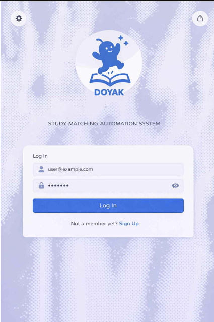
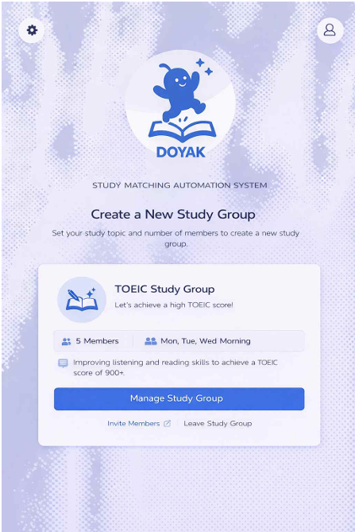
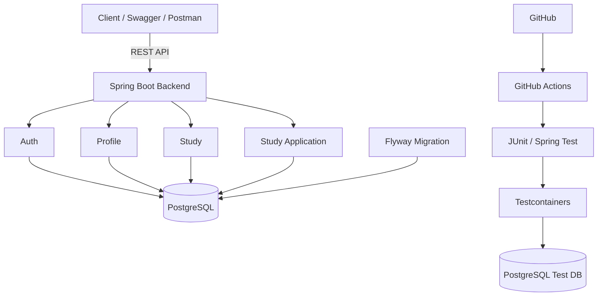
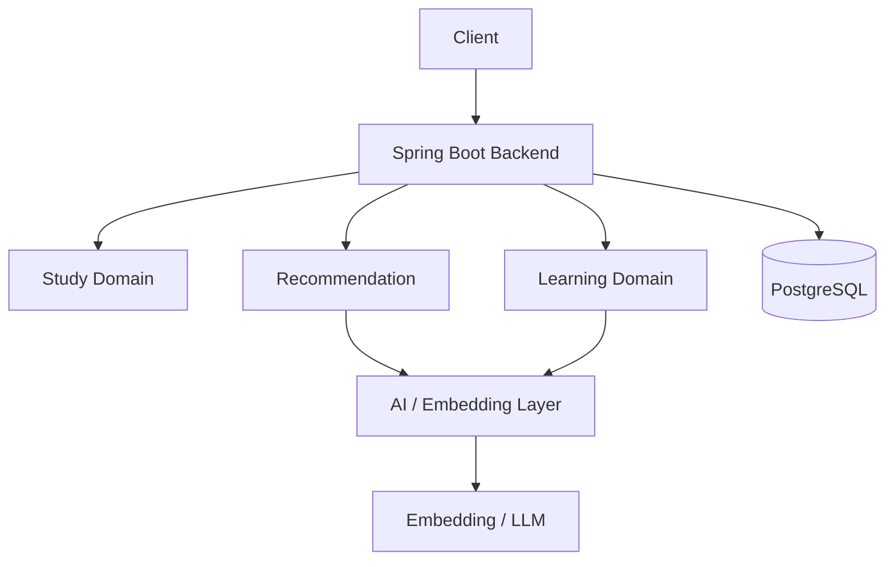
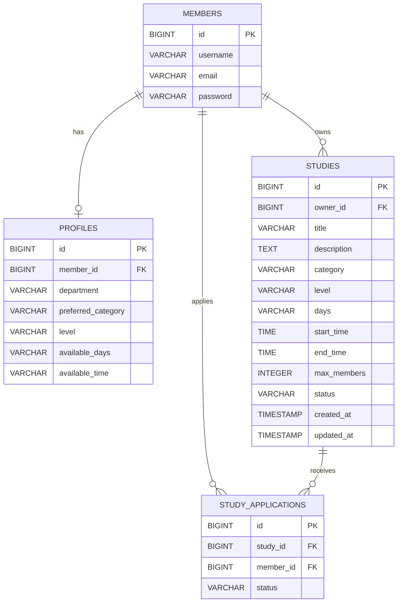

# Study Matching System# Study Matching System

## AI 기반 스터디 매칭 및 학습 운영 자동화 플랫폼

사용자의 **학습 목표, 현재 수준, 관심 분야, 가능한 요일·시간**을 기반으로 적합한 스터디를 찾고 참여할 수 있도록 지원하며, 향후 AI를 활용해 **스터디 추천 → 학습계획 생성 → 일정 관리 → 회고 → 다음 학습계획 조정**까지 연결하는 것을 목표로 하는 서비스입니다.

초기에는 **Node.js + Express + SQLite**를 이용한 MVP로 시작했으며, 현재는 실제 서비스 확장성과 백엔드 품질을 고려하여 **Java 21 + Spring Boot + PostgreSQL 기반으로 백엔드를 재설계·확장**하고 있습니다.

현재 Spring Boot 백엔드 1차 버전에서는 회원 인증, 프로필, 스터디 관리, 참여 신청 및 승인 흐름뿐 아니라 **동시성 제어, 입력 검증, 예외 처리, DB Migration, Testcontainers, CI, Swagger/OpenAPI, CORS, 환경별 Profile 분리**까지 구현했습니다.

향후에는 이 기반 위에 **Embedding 기반 Hybrid Recommendation, AI 학습계획 생성, 회고 기반 학습계획 자동 조정** 기능을 추가할 예정입니다.

---

## 프로젝트 개요

기존의 스터디 모집은 커뮤니티 게시글, 단체 채팅방, 지인 추천 등에 의존하는 경우가 많습니다.

이 과정에서는 사용자가 직접 여러 스터디를 확인하고 자신의 **목표, 수준, 관심 분야, 가능한 시간**과 맞는지를 판단해야 합니다.

또한 적합한 스터디에 참여하더라도 이후의 학습계획, 일정, 진행 상황, 회고는 다른 도구를 이용해 별도로 관리해야 하는 경우가 많습니다.

이로 인해 다음과 같은 문제가 발생합니다.

- 자신의 목표와 수준에 적합한 스터디를 찾기 어렵다.
- 관심 분야가 같더라도 학습 수준이나 가능한 시간이 맞지 않을 수 있다.
- 스터디 모집 과정에서 신청자 확인과 승인 처리가 반복된다.
- 스터디 참여 이후 학습계획과 실제 학습 과정이 분리된다.
- 학습 결과와 회고가 다음 학습계획에 충분히 반영되지 않는다.

현재 프로젝트는 다음과 같은 기본 흐름을 제공합니다.

```text
회원가입 / 로그인
        ↓
사용자 프로필
        ↓
스터디 생성 / 검색
        ↓
참여 신청
        ↓
생성자 승인 / 거절
        ↓
스터디 참여
```

향후에는 이를 다음과 같은 학습 운영 흐름으로 확장합니다.

```text
학습 목표 입력
        ↓
스터디 추천
        ↓
스터디 참여
        ↓
AI 학습계획 생성
        ↓
학습 Task / 일정
        ↓
학습 수행
        ↓
회고
        ↓
다음 계획 자동 조정
```

---

## 프로젝트 화면

아래 화면은 프로젝트 초기 UI 설계 단계에서 제작한 Prototype입니다.

현재 프로젝트의 핵심 개발 범위는 **Spring Boot 백엔드**이며, API는 Swagger/OpenAPI와 자동 테스트를 통해 검증하고 있습니다.

| 화면 | 설명 |
|---|---|
|  | 로그인 |
|  | 스터디 정보 입력 |
|  | 스터디 생성 완료 |

---

## 시스템 목표

- 사용자 프로필 기반 스터디 모집 환경 제공
- 스터디 생성 및 참여 신청 과정 단순화
- 상태 기반 스터디 신청·승인 흐름 관리
- 모집 정원 및 권한을 고려한 비즈니스 로직 구현
- 동시 요청에서도 정원 데이터의 일관성 유지
- 사용자 목표 기반 자동 추천 시스템 구축
- AI를 활용한 구조화된 학습계획 생성
- 학습 결과와 회고를 활용한 학습계획 자동 조정
- 테스트·CI·DB Migration을 통한 안정적인 백엔드 개발 환경 구축

---

# 구현 범위

## 현재 구현 완료

- [x] 회원가입
- [x] 로그인
- [x] Spring Security 기반 인증
- [x] JWT Access Token 발급 및 인증
- [x] BCrypt 비밀번호 암호화
- [x] 사용자 프로필 관리
- [x] 프로필 입력값 Validation
- [x] 스터디 생성
- [x] 스터디 상세 조회
- [x] 스터디 수정
- [x] 스터디 삭제
- [x] 스터디 모집 마감
- [x] 조건별 스터디 검색
- [x] 스터디 참여 신청
- [x] 신청 승인
- [x] 신청 거절
- [x] 신청 취소
- [x] 취소 후 재신청
- [x] 스터디 Owner 권한 검증
- [x] 모집 정원 초과 방지
- [x] 현재 참여 인원 이하로 정원 축소 방지
- [x] 정원 도달 시 모집 자동 마감
- [x] Pessimistic Lock 기반 동시 승인 제어
- [x] Global Exception Handling
- [x] JPA Specification 기반 동적 검색
- [x] PostgreSQL
- [x] Flyway Migration
- [x] 검색 컬럼 DB Index
- [x] Swagger / OpenAPI
- [x] CORS 설정
- [x] `local / test / prod` Profile 분리
- [x] Testcontainers 기반 PostgreSQL 통합 테스트
- [x] GitHub Actions CI
- [x] 자동 테스트 62개

## 향후 구현

- [ ] LearningGoal
- [ ] Rule-based Recommendation Baseline
- [ ] Embedding 기반 추천
- [ ] Hybrid Recommendation
- [ ] 추천 성능 평가
- [ ] AI 학습계획 생성
- [ ] Study Session
- [ ] Learning Task
- [ ] Reflection
- [ ] 회고 기반 학습계획 자동 조정
- [ ] Refresh Token
- [ ] Refresh Token Rotation
- [ ] Logout
- [ ] Rate Limiting
- [ ] 이메일 인증
- [ ] 비밀번호 재설정
- [ ] Dockerfile
- [ ] 실제 서비스 배포
- [ ] Monitoring / Logging 고도화

---

## Documents

- 📄 SRS: [SRS.md](docs/SRS.md)
- 📄 Design: [DESIGN.md](docs/DESIGN.md)

> 기존 문서는 초기 MVP를 기준으로 작성된 부분이 포함되어 있으며, Spring Boot 및 AI 확장 과정에 맞춰 지속적으로 업데이트할 예정입니다.

---

# 주요 기능

## 1. 회원 및 인증

- 회원가입
- 로그인
- BCrypt 기반 비밀번호 암호화
- JWT Access Token 발급
- Spring Security 기반 인증 처리
- 인증이 필요한 API 접근 제어

인증 흐름은 다음과 같습니다.

```text
Login
  ↓
ID / Password 검증
  ↓
JWT Access Token 발급
  ↓
Authorization Header
  ↓
Protected API 호출
```

```http
Authorization: Bearer {accessToken}
```

현재 Access Token 기반 인증까지 구현되어 있으며, 이후 **Refresh Token Rotation과 Logout** 기능을 추가할 예정입니다.

---

## 2. 사용자 프로필

사용자는 스터디 추천 및 검색에 활용할 수 있는 프로필 정보를 관리합니다.

현재 프로필에서는 다음과 같은 정보를 다룹니다.

- 학과
- 선호 스터디 분야
- 현재 수준
- 가능한 요일
- 가능한 시간

입력 데이터에는 **Jakarta Bean Validation**을 적용하여 잘못된 형식의 값이 Service 계층으로 전달되기 전에 차단합니다.

---

## 3. 스터디 관리

스터디 생성자는 다음 기능을 사용할 수 있습니다.

- 스터디 생성
- 스터디 조회
- 스터디 수정
- 스터디 삭제
- 모집 마감
- 모집 정원 설정

스터디는 다음과 같은 주요 정보를 가집니다.

```text
title
description
category
level
days
startTime
endTime
maxMembers
status
owner
```

스터디 상태는 다음과 같이 관리됩니다.

```text
RECRUITING
CLOSED
```

---

## 4. 동적 스터디 검색

검색 조건을 모두 입력해야 하는 구조가 아니라 필요한 조건만 조합하여 검색할 수 있도록 `JpaSpecificationExecutor`와 JPA `Specification`을 사용했습니다.

지원 조건:

```text
category
level
status
```

다음과 같은 검색 조합을 지원합니다.

```text
category

level

status

category + level

category + status

level + status

category + level + status

검색 조건 없음
```

---

## 5. 스터디 참여 신청

사용자는 모집 중인 스터디에 참여 신청할 수 있습니다.

신청 상태는 다음과 같이 관리됩니다.

```text
PENDING
APPROVED
REJECTED
CANCELED
```

주요 상태 전이:

```text
              ┌── APPROVED
PENDING ──────┼── REJECTED
              └── CANCELED

CANCELED ───────→ PENDING
                  재신청
```

승인 또는 거절된 신청을 사용자가 임의로 취소하는 등의 잘못된 상태 전이는 제한합니다.

---

## 6. 권한 검증

스터디를 수정하거나 삭제하거나 신청자를 승인·거절하는 기능은 해당 스터디 생성자만 사용할 수 있도록 제한합니다.

```text
Request User
     ↓
Study Owner 확인
     ↓
일치 여부 확인
 ┌───┴────┐
YES       NO
 ↓         ↓
처리       403 Forbidden
```

---

# 실제 사용 흐름

1. 사용자는 회원가입 후 로그인한다.
2. 로그인에 성공하면 JWT Access Token이 발급된다.
3. 사용자는 자신의 프로필 정보를 등록하거나 수정한다.
4. 사용자는 새로운 스터디를 생성하거나 조건에 맞는 스터디를 검색한다.
5. 다른 사용자는 모집 중인 스터디에 참여 신청한다.
6. 스터디 생성자는 신청 목록을 확인한다.
7. 스터디 생성자는 신청을 승인하거나 거절한다.
8. 승인 인원이 정원에 도달하면 스터디 모집 상태가 `CLOSED`가 된다.
9. 모집 정원이 이미 참여 중인 인원보다 작아지도록 수정하는 요청은 차단된다.

---

# 동시성 문제 해결

스터디 모집 정원이 제한되어 있기 때문에 여러 신청 승인 요청이 동시에 발생하면 **Race Condition**으로 인해 정원을 초과할 가능성이 있습니다.

예를 들어 정원이 3명이고 현재 인원이 2명인 상황에서 두 요청이 동시에 실행되면 다음 문제가 발생할 수 있습니다.

```text
Thread A                 Thread B

현재 인원 = 2 확인       현재 인원 = 2 확인

승인 가능                 승인 가능

사용자 A 승인             사용자 B 승인

        ↓

실제 인원 = 4
정원 = 3
```

이를 방지하기 위해 Study 조회 시 **Pessimistic Write Lock**을 적용했습니다.

```text
Request A ─────┐
               │
               ▼
        Study Row Lock
               │
               ▼
      승인 및 정원 검증
               │
               ▼
           Commit
               │
Request B ─────┘
```

한 트랜잭션이 특정 스터디의 승인 처리를 완료할 때까지 다른 승인 요청은 동일한 Study Row에 대한 처리를 기다리도록 했습니다.

이를 실제로 검증하기 위해 다음 도구를 이용한 동시성 테스트를 작성했습니다.

- `ExecutorService`
- `CountDownLatch`
- `AtomicInteger`

동시에 두 개의 승인 요청을 발생시킨 뒤 다음 조건을 검증합니다.

```text
승인 성공 = 1
승인 실패 = 1

최종 참여 인원 <= maxMembers
Study Status = CLOSED
```

---

# 모집 정원 관리

스터디 생성자도 모집 인원에 포함합니다.

따라서 현재 참여 인원은 다음과 같이 계산합니다.

```text
현재 참여 인원
=
스터디 생성자 1명
+
APPROVED 신청자 수
```

예를 들어:

```text
Owner 1
Approved Member 2

현재 참여 인원 = 3
```

이 경우 `maxMembers`를 2로 줄일 수 없습니다.

정원 수정 규칙:

```text
newMaxMembers > currentMemberCount
→ 수정 가능

newMaxMembers == currentMemberCount
→ 수정 가능
→ Study CLOSED

newMaxMembers < currentMemberCount
→ 수정 거부
```

정원 수정과 신청 승인 모두 동일한 Study Row에 Lock을 사용하여 동시에 발생하는 요청에서도 정원 불변식이 깨지지 않도록 설계했습니다.

---

# 시스템 아키텍처

현재 시스템은 **Spring Boot Backend**를 중심으로 구성되어 있습니다.


```mermaid
graph TD

    CLIENT[Client / Swagger / Postman]

    CLIENT -->|REST API| BACKEND[Spring Boot Backend]

    BACKEND --> AUTH[Auth]
    BACKEND --> PROFILE[Profile]
    BACKEND --> STUDY[Study]
    BACKEND --> APPLICATION[Study Application]

    AUTH --> DB[(PostgreSQL)]
    PROFILE --> DB
    STUDY --> DB
    APPLICATION --> DB

    FLYWAY[Flyway Migration] --> DB

    TEST[JUnit / Spring Test] --> TC[Testcontainers]
    TC --> TESTDB[(PostgreSQL Test DB)]

    GITHUB[GitHub] --> ACTIONS[GitHub Actions]
    ACTIONS --> TEST
```

향후 AI 기능이 추가되면 다음과 같은 구조로 확장할 계획입니다.


```mermaid
graph TD

    CLIENT[Client]

    CLIENT --> BACKEND[Spring Boot Backend]

    BACKEND --> STUDY[Study Domain]
    BACKEND --> LEARNING[Learning Domain]
    BACKEND --> REC[Recommendation]

    REC --> AI[AI / Embedding Layer]
    LEARNING --> AI

    BACKEND --> DB[(PostgreSQL)]

    AI --> MODEL[Embedding / LLM]
```

AI 로직이 복잡해지고 독립적인 모델 운영이 필요해질 경우 Python 기반 AI Service로 분리하는 것을 고려합니다.

---

# 기술 스택

| 구분 | 기술 |
|---|---|
| Language | Java 21 |
| Backend | Spring Boot |
| Security | Spring Security |
| Authentication | JWT |
| ORM | Spring Data JPA / Hibernate |
| Database | PostgreSQL |
| Migration | Flyway |
| Dynamic Query | JPA Specification |
| Validation | Jakarta Bean Validation |
| API Documentation | Springdoc OpenAPI / Swagger UI |
| Test | JUnit, Spring Boot Test, MockMvc |
| Integration Test | Testcontainers |
| Build | Gradle |
| Container | Docker |
| CI | GitHub Actions |
| API Test | Swagger UI, Postman |
| Version Control | Git / GitHub |

---

# 데이터베이스 구조

현재 Spring Boot 백엔드는 다음 핵심 도메인을 중심으로 구성되어 있습니다.

```text
Member
Profile
Study
StudyApplication
```

관계:

```text
Member
 ├── Profile
 ├── Study (Owner)
 └── StudyApplication

Study
 └── StudyApplication
```

## ERD


```mermaid
erDiagram

    MEMBERS ||--o| PROFILES : has
    MEMBERS ||--o{ STUDIES : owns
    MEMBERS ||--o{ STUDY_APPLICATIONS : applies
    STUDIES ||--o{ STUDY_APPLICATIONS : receives

    MEMBERS {
        BIGINT id PK
        VARCHAR username
        VARCHAR email
        VARCHAR password
    }

    PROFILES {
        BIGINT id PK
        BIGINT member_id FK
        VARCHAR department
        VARCHAR preferred_category
        VARCHAR level
        VARCHAR available_days
        VARCHAR available_time
    }

    STUDIES {
        BIGINT id PK
        BIGINT owner_id FK
        VARCHAR title
        TEXT description
        VARCHAR category
        VARCHAR level
        VARCHAR days
        TIME start_time
        TIME end_time
        INTEGER max_members
        VARCHAR status
        TIMESTAMP created_at
        TIMESTAMP updated_at
    }

    STUDY_APPLICATIONS {
        BIGINT id PK
        BIGINT study_id FK
        BIGINT member_id FK
        VARCHAR status
    }
```

> ERD는 현재 Spring Boot 도메인 기준이며, 향후 `LearningGoal`, `Recommendation`, `LearningPlan`, `Reflection` 등이 추가되면서 확장될 예정입니다.

---

# Flyway Migration

DB Schema 변경은 Flyway를 이용하여 관리합니다.

현재 Migration:

```text
V1__create_initial_schema.sql
V2__create_profiles.sql
V3__create_studies.sql
V4__create_study_applications.sql
V5__add_study_indexes.sql
```

애플리케이션 실행 시 Flyway가 적용되지 않은 Migration을 자동으로 실행합니다.

---

# DB Index

현재 스터디 검색 및 조회에 자주 사용되는 컬럼에 인덱스를 추가했습니다.

```text
studies.category
studies.level
studies.status
studies.owner_id
```

현재는 동적 검색 조건이 다양한 조합으로 사용되기 때문에 우선 개별 인덱스를 적용했습니다.

향후 실제 데이터 규모가 커질 경우 PostgreSQL의 `EXPLAIN ANALYZE`를 이용해 실제 실행 계획을 확인한 뒤 필요한 복합 인덱스를 추가할 예정입니다.

---

# 데이터 무결성 및 비즈니스 제약

현재 다음 규칙을 적용하고 있습니다.

- 동일한 `username`은 중복될 수 없다.
- 동일한 `email`은 중복될 수 없다.
- 한 사용자는 하나의 프로필을 가진다.
- 존재하지 않는 사용자의 프로필은 조회할 수 없다.
- 스터디 생성자만 해당 스터디를 수정·삭제할 수 있다.
- 사용자는 자신이 만든 스터디에 참여 신청할 수 없다.
- 동일한 사용자의 중복 신청을 방지한다.
- 모집이 종료된 스터디에는 새로운 신청을 할 수 없다.
- `PENDING` 상태의 신청만 승인 또는 거절할 수 있다.
- `CANCELED` 신청은 다시 신청할 수 있다.
- `APPROVED`, `REJECTED` 상태의 신청은 임의로 취소할 수 없다.
- 승인 인원은 `maxMembers`를 초과할 수 없다.
- 스터디 Owner도 `maxMembers`에 포함된다.
- 현재 참여 인원보다 작은 값으로 `maxMembers`를 줄일 수 없다.
- 정원이 현재 참여 인원과 같아지면 모집을 종료한다.

---

# Global Exception Handling

비즈니스 로직에서 발생하는 예외를 Controller마다 직접 처리하지 않고 `GlobalExceptionHandler`에서 일관된 형식으로 처리합니다.

일반 오류 응답:

```json
{
  "status": 404,
  "message": "에러 메시지",
  "timestamp": "..."
}
```

Validation 오류의 경우 필드별 오류 내용을 함께 반환합니다.

```json
{
  "status": 400,
  "message": "입력값 검증에 실패했습니다.",
  "errors": {
    "level": "...",
    "availableTime": "..."
  },
  "timestamp": "..."
}
```

---

# Validation

Profile 등의 사용자 입력에는 **Jakarta Bean Validation**을 적용했습니다.

예를 들어 다음 항목을 검증합니다.

- 필수값
- 문자열 최대 길이
- 허용된 Level 값
- 허용된 Category 값
- 가능한 요일 형식
- 시간 입력 형식

잘못된 요청은 Service 로직 실행 전에 `400 Bad Request`로 처리됩니다.

---

# Testing

현재 백엔드에는 **62개의 자동 테스트**가 작성되어 있습니다.

## Authentication

- 회원가입 성공
- BCrypt 비밀번호 암호화 확인
- username 중복
- email 중복
- 로그인 성공
- 잘못된 비밀번호
- 존재하지 않는 사용자
- JWT Access Token 발급 확인

## Profile

- 프로필 최초 생성
- 프로필 조회
- 기존 프로필 수정
- 중복 프로필 생성 방지
- 존재하지 않는 사용자
- 존재하지 않는 프로필
- Controller Validation

## Study

- 스터디 생성
- 상세 조회
- 수정
- 삭제
- Owner 권한 검증
- 동적 검색
- Pagination
- 내 스터디 조회
- Category 단독 검색
- Level 단독 검색
- Status 단독 검색
- 복합 조건 검색
- 정원 축소 검증
- 정원 도달 시 모집 종료

## Study Application

- 참여 신청
- 승인
- 거절
- 취소
- 재신청
- 잘못된 상태 전이
- 모집 종료 상태 검증
- 자기 스터디 신청 방지
- 중복 신청 방지

## Concurrency

- 두 승인 요청 동시 실행
- 정원 초과 여부 검증
- 하나의 요청만 성공하는지 검증
- 최종 모집 상태 검증

## Exception / Controller

- `400 Bad Request`
- `401 Unauthorized`
- `403 Forbidden`
- `404 Not Found`
- `409 Conflict`
- Validation Error

---

# Testcontainers

테스트가 개발자의 로컬 PostgreSQL 환경에 의존하지 않도록 **Testcontainers**를 사용합니다.

```text
./gradlew test
      ↓
PostgreSQL Container 생성
      ↓
Flyway Migration
      ↓
Spring Context 실행
      ↓
Integration Test
      ↓
Container 제거
```

따라서 개발자가 별도의 테스트 DB를 직접 생성하거나 초기화하지 않아도 동일한 PostgreSQL 환경에서 테스트할 수 있습니다.

---

# CI

GitHub Actions를 통해 `main` 브랜치의 Push 및 Pull Request에서 백엔드 테스트를 자동 실행합니다.

```text
Push / Pull Request
        ↓
GitHub Actions
        ↓
Java 21
        ↓
Gradle
        ↓
Testcontainers
        ↓
PostgreSQL
        ↓
Automated Test
```

테스트 결과는 GitHub Actions에서 확인할 수 있으며 테스트 리포트도 Artifact로 저장합니다.

---

# API Documentation

Springdoc OpenAPI를 적용하여 Swagger UI에서 현재 API 목록과 Request / Response 구조를 확인할 수 있습니다.

로컬 실행 후:

```text
http://localhost:8080/swagger-ui/index.html
```

OpenAPI JSON:

```text
http://localhost:8080/v3/api-docs
```

Swagger에서 JWT Access Token을 등록하면 인증이 필요한 API도 직접 호출할 수 있습니다.

---

# CORS

Spring Security의 `CorsConfigurationSource`를 이용하여 허용 Origin을 환경별로 설정합니다.

Local 기본 Origin:

```text
http://localhost:3000
http://localhost:5173
```

운영환경에서는 `CORS_ALLOWED_ORIGINS` 환경변수를 통해 실제 Frontend 주소를 지정합니다.

---

# Environment Profiles

설정을 다음 환경으로 분리했습니다.

```text
application.properties
application-local.properties
application-prod.properties
application-test.properties
```

## Common

공통 설정:

```text
Application Name
JPA
Flyway
JWT
Server Port
```

## Local

```text
Local PostgreSQL
DEBUG Logging
SQL Logging
Local CORS
```

## Test

```text
Testcontainers
Test JWT Secret
Flyway
```

## Production

```text
Production DB Environment Variables
INFO Logging
SQL Logging Disabled
Production CORS
```

DB Password와 JWT Secret 등의 민감 정보는 Git Repository에 저장하지 않고 **환경변수로 주입**합니다.

---

# 프로젝트 구조

```text
study-matching-system
│
├── .github
│   └── workflows
│       └── backend-test.yml
│
├── infra
│   └── compose.local.yml
│
├── spring-backend
│   │
│   ├── src
│   │   ├── main
│   │   │   ├── java
│   │   │   │   └── com.studymatching
│   │   │   │       ├── auth
│   │   │   │       ├── common
│   │   │   │       ├── member
│   │   │   │       ├── profile
│   │   │   │       ├── study
│   │   │   │       └── studyapplication
│   │   │   │
│   │   │   └── resources
│   │   │       ├── application.properties
│   │   │       ├── application-local.properties
│   │   │       ├── application-prod.properties
│   │   │       └── db
│   │   │           └── migration
│   │   │               ├── V1__create_initial_schema.sql
│   │   │               ├── V2__create_profiles.sql
│   │   │               ├── V3__create_studies.sql
│   │   │               ├── V4__create_study_applications.sql
│   │   │               └── V5__add_study_indexes.sql
│   │   │
│   │   └── test
│   │
│   ├── build.gradle
│   └── gradlew
│
├── docs
│
├── .env.example
└── README.md
```

---

# 초기 MVP

본 프로젝트는 처음부터 Spring Boot로 시작한 프로젝트가 아닙니다.

초기 MVP에서는 다음 기술을 사용했습니다.

```text
Node.js
Express
SQLite
HTML / CSS / JavaScript
```

초기 버전에서는 다음 핵심 흐름을 빠르게 검증했습니다.

```text
회원가입
→ 로그인
→ 프로필
→ 스터디 생성
→ 참여 신청
→ 승인 / 거절
```

이후 프로젝트를 실제 백엔드 포트폴리오 및 AI 서비스로 확장하기 위해 Spring Boot 기반으로 재설계했습니다.

```text
Node.js / SQLite MVP
        ↓
도메인 및 기능 검증
        ↓
Spring Boot Migration
        ↓
PostgreSQL
        ↓
Security / JWT
        ↓
Concurrency
        ↓
Automated Test
        ↓
Testcontainers / CI
        ↓
AI Recommendation / Learning Automation
```

---

# 문제 해결

## 1. 동시 승인 시 모집 정원 초과

### 문제

두 승인 요청이 동시에 정원을 확인하면 모두 승인 가능한 것으로 판단할 수 있었습니다.

### 해결

`PESSIMISTIC_WRITE` Lock을 이용하여 동일 Study에 대한 승인 처리를 직렬화했습니다.

### 검증

실제 Thread 기반 동시성 테스트를 작성해 Race Condition을 재현하고 결과를 검증했습니다.

---

## 2. 테스트의 로컬 DB 의존성

### 문제

테스트가 개발자의 로컬 PostgreSQL에 의존하여 환경에 따라 결과가 달라질 수 있었습니다.

### 해결

Testcontainers를 도입하여 테스트 실행 시 PostgreSQL 컨테이너를 자동으로 생성하도록 변경했습니다.

---

## 3. Controller 필터 조건 누락

### 문제

Service에서는 부분 조건 검색을 지원했지만 Controller가 모든 검색 조건이 존재하는 경우에만 검색 Service를 호출하는 문제가 있었습니다.

### 해결

검색 요청을 항상 동적 검색 Service로 전달하도록 수정하고 Controller 테스트를 추가했습니다.

---

## 4. Lazy Loading 테스트 오류

### 문제

테스트에서 Transaction 밖에서 Lazy Association에 접근하여 `LazyInitializationException`이 발생했습니다.

### 해결

테스트가 실제 Service Response 및 Entity ID를 기준으로 검증하도록 수정했습니다.

---

## 5. 테스트 데이터 삭제 시 FK 문제

### 문제

Member보다 Study를 늦게 제거하면서 Foreign Key Constraint 오류가 발생했습니다.

### 해결

연관 관계 순서에 따라 다음 순서로 테스트 데이터를 정리하도록 수정했습니다.

```text
StudyApplication
→ Study
→ Profile
→ Member
```

---

# AI Recommendation Roadmap

다음 개발 단계에서는 사용자 학습 목표를 저장하는 `LearningGoal`부터 구현합니다.

전체 추천 흐름:

```text
LearningGoal
       ↓
Baseline Recommendation
       ↓
Embedding
       ↓
Semantic Similarity
       ↓
Level Compatibility
       ↓
Schedule Compatibility
       ↓
Category Compatibility
       ↓
Hybrid Matching Score
       ↓
Top-K Recommendation
```

초기 추천 Score는 다음과 같은 구조로 설계할 예정입니다.

```text
Matching Score
=
Semantic Similarity × w1
+
Level Compatibility × w2
+
Schedule Compatibility × w3
+
Category Compatibility × w4
```

---

# 추천 시스템 평가

AI를 적용했다는 사실만으로 추천 시스템의 품질이 좋아졌다고 판단하지 않습니다.

다음 세 방식을 비교할 계획입니다.

```text
Baseline
→ Category / Rule 기반 추천

Model A
→ Embedding Similarity

Model B
→ Embedding + Rule Hybrid Recommendation
```

추천 성능은 다음과 같은 지표로 평가합니다.

```text
Precision@K
NDCG@K
```

잘못된 추천 사례 역시 분석하여 추천 가중치와 규칙을 개선할 예정입니다.

---

# AI Learning Plan

사용자가 다음과 같은 정보를 입력합니다.

```text
Goal
Current Level
Duration
Available Study Time
```

예:

```text
목표: SQLD 취득
현재 수준: 초급
기간: 6주
주당 학습시간: 8시간
```

AI는 이를 자연어 답변만으로 반환하지 않고 구조화된 데이터로 생성합니다.

```json
{
  "goal": "SQLD 취득",
  "weeks": [
    {
      "week": 1,
      "objective": "데이터 모델링 기본 개념 이해",
      "tasks": [
        "엔터티와 속성 학습",
        "관계와 식별자 학습",
        "기출문제 풀이"
      ]
    }
  ]
}
```

이를 DB에 저장하여 실제 Learning Task 및 일정과 연결할 계획입니다.

---

# Learning Feedback Loop

프로젝트의 최종 목표는 AI가 계획을 한 번 생성하고 끝나는 것이 아니라 학습 결과를 다시 다음 계획에 반영하는 것입니다.

```text
Learning Goal
       ↓
Study Recommendation
       ↓
Learning Plan
       ↓
Learning Task
       ↓
Task Execution
       ↓
Reflection
       ↓
Progress Analysis
       ↓
Plan Adjustment
       ↓
Next Learning Plan
       └─────────── 반복
```

예를 들어:

```text
계획된 Task: 5개
완료: 2개
이해도: 2 / 5
난이도: 4 / 5
```

라면 이후 계획에서:

```text
학습량 감소
복습 Task 추가
미완료 Task 재배치
난이도 조정
```

등을 수행하도록 설계할 예정입니다.

이를 통해 단순한 스터디 모집 서비스를 넘어 **사용자의 학습과정을 지속적으로 지원하는 AI 기반 학습 운영 자동화 플랫폼**으로 확장하는 것이 최종 목표입니다.

---

# Future Backend Improvements

AI 기능 외에도 실제 서비스 운영을 위해 다음 기능을 추가할 예정입니다.

- Refresh Token
- Refresh Token Rotation
- Logout
- Email Verification
- Password Reset
- Rate Limiting
- Dockerfile
- Deployment
- Monitoring
- Logging 고도화

---

# What I Learned

이 프로젝트를 통해 단순한 CRUD API 구현을 넘어 실제 백엔드 서비스에서 발생할 수 있는 여러 문제를 직접 다뤘습니다.

특히 다음 경험을 얻었습니다.

- Spring Security와 JWT 기반 인증 구조 설계
- BCrypt를 이용한 Password Hashing
- JPA Entity 및 연관관계 설계
- 상태 전이 기반 비즈니스 로직 구현
- Owner 기반 Authorization
- Dynamic Query 구현
- DTO Validation
- Global Exception Handling
- Transaction 관리
- Pessimistic Lock을 이용한 동시성 제어
- Race Condition 재현 및 테스트
- PostgreSQL 기반 관계형 데이터 모델링
- Flyway Migration 관리
- DB Index 설계
- Testcontainers 기반 통합 테스트
- Controller / Service 테스트 분리
- GitHub Actions 기반 CI 구축
- Swagger/OpenAPI 문서화
- 환경별 Spring Profile 관리

기능을 구현하는 데 그치지 않고 다음과 같은 흐름으로 문제를 해결하는 경험을 쌓았습니다.

```text
문제 발견
→ 재현
→ 원인 분석
→ 설계 수정
→ 자동 테스트 작성
→ CI 검증
```

---

# 프로젝트 결과

현재 Spring Boot 기반 Backend 1차 버전에서 다음을 완료했습니다.

- Spring Boot 기반 Backend Migration
- JWT 인증
- 사용자 프로필
- 스터디 CRUD
- 동적 스터디 검색
- 참여 신청 / 승인 / 거절 / 취소 / 재신청
- Owner 권한 검증
- 모집 정원 관리
- 동시 승인 Race Condition 방지
- PostgreSQL
- Flyway
- DB Index
- Validation
- Global Exception Handling
- Swagger/OpenAPI
- CORS
- Testcontainers
- GitHub Actions
- 환경별 Profile 분리
- 62개 자동 테스트

현재 백엔드 기반 작업을 마치고 **AI 추천 및 학습 운영 기능 개발 단계로 확장 중입니다.**

---

# 실행 방법

## 사전 요구사항

- Java 21
- Docker Desktop
- Git
- IntelliJ IDEA 권장

---

## 1. Repository Clone

```bash
git clone https://github.com/22junreal/study-matching-system.git

cd study-matching-system
```

---

## 2. Environment Variables

프로젝트 루트에 `.env` 파일을 생성합니다.

`.env.example`을 참고하여 다음 값을 설정합니다.

```dotenv
DB_URL=jdbc:postgresql://localhost:5432/...
DB_USERNAME=...
DB_PASSWORD=...

POSTGRES_DB=...
POSTGRES_USER=...
POSTGRES_PASSWORD=...

JWT_SECRET=...
```

> `.env` 파일은 Git에 Commit하지 않습니다.

---

## 3. PostgreSQL 실행

프로젝트 루트에서 다음 명령어를 실행합니다.

```bash
docker compose --env-file .env -f infra/compose.local.yml up -d
```

실행 확인:

```bash
docker ps
```

---

## 4. Backend 실행

```bash
cd spring-backend
```

macOS에서 Gradle Wrapper에 실행 권한이 없는 경우:

```bash
bash gradlew bootRun
```

또는 IntelliJ의 `StudyMatchingApiApplication` 실행 구성을 이용합니다.

Active Profile:

```text
local
```

필수 환경변수:

```text
DB_URL
DB_USERNAME
DB_PASSWORD
JWT_SECRET
```

---

## 5. Test 실행

```bash
bash gradlew clean test
```

macOS에서 테스트 리포트 확인:

```bash
open build/reports/tests/test/index.html
```

현재 기준:

```text
62 Tests
```

---

## 6. Swagger

서버 실행 후 다음 주소에서 API 문서를 확인할 수 있습니다.

```text
http://localhost:8080/swagger-ui/index.html
```

OpenAPI JSON:

```text
http://localhost:8080/v3/api-docs
```

---

# 최종 목표

본 프로젝트의 최종 목표는 단순한 스터디 모집 서비스를 만드는 것이 아닙니다.

사용자의 학습 데이터를 기반으로 다음 흐름을 하나의 시스템에서 연결하는 것을 목표로 합니다.

```text
사용자 학습 목표
        ↓
적합한 스터디 추천
        ↓
스터디 참여
        ↓
AI 학습계획 생성
        ↓
학습 Task 실행
        ↓
회고
        ↓
학습 진행도 분석
        ↓
다음 계획 자동 조정
```

이를 통해 **AI 기반 스터디 매칭 및 학습 운영 자동화 플랫폼**으로 발전시키는 것이 프로젝트의 최종 방향입니다.