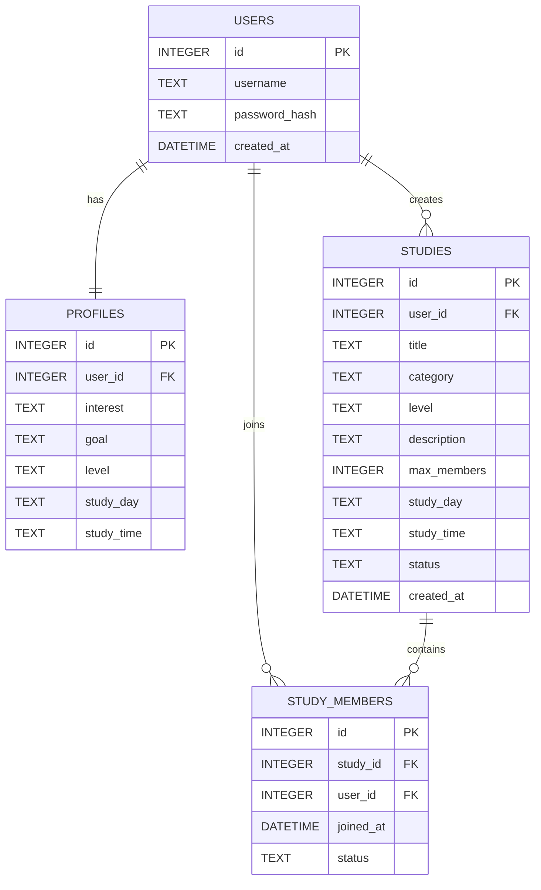

## 시스템 아키텍처

본 시스템은 웹 기반 Client–Server 구조로 설계된다.

### Client (Frontend)
- HTML, CSS, JavaScript 기반 웹 페이지
- 사용자 입력 처리
- API 요청 전송 및 응답 데이터 표시

### Server (Backend)
- Node.js + Express 기반 REST API 서버
- 사용자 인증 처리
- 스터디 생성 및 조회 기능 제공
- 데이터베이스와 통신

### Database
- SQLite 기반 데이터 저장
- 사용자 정보, 프로필 정보, 스터디 정보 관리

### Architecture Diagram

User Browser  
↓  
Frontend (HTML / CSS / JS)  
↓ REST API  
Backend Server (Node.js / Express)  
↓  
SQLite Database

## 기술 스택

Frontend
- HTML
- CSS
- JavaScript

Backend
- Node.js
- Express

Database
- SQLite

Deployment
- Local environment

Source Repository
- GitHub

## 설계 이유

본 시스템은 스터디 모집 과정의 비효율을 해결하고, 향후 자동 매칭 기능으로 확장할 수 있도록 다음과 같은 기준으로 설계되었다.

---

### 1. Client–Server 구조 선택 이유

본 시스템은 웹 기반 서비스로, 사용자 인터페이스와 비즈니스 로직을 분리하기 위해 Client–Server 구조를 채택하였다.

- Client는 사용자 입력 처리 및 UI를 담당하고  
- Server는 인증 처리, 스터디 생성 및 조회, 참여 관리 등 핵심 로직을 담당한다  

이를 통해 유지보수성과 확장성을 확보할 수 있으며, 향후 모바일 앱 또는 다른 클라이언트로 확장하기 용이하다.

---

### 2. REST API 구조 선택 이유

서버는 REST API 방식으로 설계하였다.

- HTTP Method(GET, POST, PATCH)를 활용하여 자원을 명확하게 구분하였다  
- URL을 통해 자원의 의미를 직관적으로 표현하였다  

예:
- `/api/studies` : 스터디 조회 및 생성  
- `/api/studies/:studyId/join` : 스터디 참여 신청  

이 구조는 클라이언트와 서버 간의 결합도를 낮추고, 확장성과 재사용성을 높인다.

---

### 3. SQLite 선택 이유

본 프로젝트는 MVP 단계의 소규모 시스템으로, 복잡한 DB 서버 구축 없이 빠르게 개발 및 테스트가 가능한 SQLite를 선택하였다.

- 별도의 DB 서버 설치 없이 파일 기반으로 동작  
- 개발 및 테스트 환경에서 설정이 간단  
- 초기 서비스 단계에서 충분한 성능 제공  

향후 사용자 수 증가 시 MySQL, PostgreSQL 등으로 확장 가능하도록 설계하였다.

---

### 4. 테이블 분리 설계 이유

데이터는 `users`, `profiles`, `studies`, `study_members`로 분리하였다.

#### (1) users / profiles 분리
- 인증 정보와 사용자 프로필 정보를 분리하여 보안성과 확장성을 확보하였다  
- 향후 프로필 확장(관심사, 활동 기록 등)에 유리하다  

#### (2) studies / study_members 분리
- 스터디 정보와 참여 관계를 분리하여 N:M 관계를 명확히 표현하였다  
- 하나의 스터디에 여러 사용자가 참여할 수 있도록 설계하였다  

이 구조는 데이터 중복을 방지하고, 관계형 데이터 모델의 장점을 활용하기 위함이다.

---

### 5. 상태(status) 기반 설계 이유

스터디 모집 및 참여 관리를 위해 상태 기반 설계를 적용하였다.

- `studies.status` : 모집 상태 (`recruiting`, `closed`)
- `study_members.status` : 참여 상태 (`pending`, `approved`, `rejected`)

이를 통해 다음과 같은 제어가 가능하다.

- 모집 마감 상태에서 추가 신청 및 승인 제한  
- 참여 신청 → 승인/거절 흐름 명확화  
- 상태 전이를 통한 데이터 일관성 유지  

상태 기반 설계는 비즈니스 로직을 단순화하고, 시스템의 예측 가능성을 높인다.

---

### 6. 데이터 무결성 및 제약 조건 설계 이유

데이터의 일관성과 오류 방지를 위해 다음과 같은 제약을 적용하였다.

- `(study_id, user_id)` UNIQUE → 중복 참여 신청 방지  
- `max_members` 제한 → 정원 초과 방지  
- 상태 값 제한 → 잘못된 데이터 입력 방지  

또한 서버 로직에서도 동일한 검증을 수행하여  
DB + 서버 이중 검증 구조로 안정성을 확보하였다.

---

### 7. 권한 기반 접근 제어 설계 이유

스터디 관리 기능에서 사용자 권한을 분리하였다.

- 일반 사용자 → 스터디 조회 및 참여 신청  
- 스터디 생성자 → 참여 승인 및 거절  

이를 통해 다음을 보장한다.

- 비인가 사용자의 데이터 변경 방지  
- 책임 기반 데이터 관리  
- 시스템 보안 강화  

---

### 8. 향후 확장 고려 설계

본 시스템은 MVP 단계이지만, 다음 기능 확장을 고려하여 설계하였다.

- 사용자 프로필 기반 자동 매칭 알고리즘  
- 추천 시스템  
- 스터디 활동 데이터 분석  

이를 위해 사용자, 스터디, 참여 데이터를 분리된 구조로 설계하였다.

## 데이터베이스 설계 (ERD)

### users

| column | type | description |
|------|------|-------------|
| id | INTEGER | 사용자 고유 ID |
| username | TEXT | 사용자 이름 |
| password_hash | TEXT | 암호화된 사용자 비밀번호 |
| created_at | DATETIME | 가입 시간 |

---

### profiles

| column | type | description |
|------|------|-------------|
| id | INTEGER | 프로필 ID |
| user_id | INTEGER | 사용자 ID (users.id 참조) |
| interest | TEXT | 관심 분야 |
| goal | TEXT | 학습 목표 |
| level | TEXT | 학습 수준 |
| study_day | TEXT | 공부 요일 |
| study_time | TEXT | 공부 시간 |

---

### studies
| column | type | description |
|------|------|-------------|
| id | INTEGER | 스터디 ID |
| user_id | INTEGER | 생성한 사용자 ID |
| title | TEXT | 스터디 제목 |
| category | TEXT | 스터디 분야 |
| level | TEXT | 모집 대상 수준 |
| description | TEXT | 스터디 설명 |
| max_members | INTEGER | 모집 인원 |
| study_day | TEXT | 모집 요일 |
| study_time | TEXT | 모집 시간 |
| status | TEXT | 모집 상태 (`recruiting`, `closed`) |
| created_at | DATETIME | 생성 시간 |

### study_members

| column | type | description |
|------|------|-------------|
| id | INTEGER | 참여 ID |
| study_id | INTEGER | 스터디 ID (studies.id 참조) |
| user_id | INTEGER | 참여 사용자 ID (users.id 참조) |
| joined_at | DATETIME | 참여 신청 시간 |
| status | TEXT | 참여 상태 (`pending`, `approved`, `rejected`) |

---

## ERD 설명

본 시스템은 `users`, `profiles`, `studies`, `study_members` 4개의 주요 테이블로 구성된다.

- `users`는 사용자 계정 정보를 저장한다.
- `profiles`는 사용자의 관심 분야, 학습 목표, 수준, 공부 요일, 공부 시간을 저장한다.
- `studies`는 사용자가 생성한 스터디 정보를 저장한다.
- `study_members`는 사용자와 스터디 간 참여 관계를 저장한다.

테이블 관계는 다음과 같다.

- 한 명의 사용자(`users`)는 하나의 프로필(`profiles`)을 가진다.
- 한 명의 사용자(`users`)는 여러 개의 스터디(`studies`)를 생성할 수 있다.
- 한 명의 사용자(`users`)는 여러 개의 스터디 참여 정보(`study_members`)를 가질 수 있다.
- 하나의 스터디(`studies`)는 여러 명의 참여자(`study_members`)를 가질 수 있다.

## ERD 이미지

아래는 본 시스템의 데이터베이스 관계를 나타낸 ERD이다.

## 데이터 무결성 제약 조건

본 시스템은 데이터의 일관성과 중복 방지를 위해 다음과 같은 제약 조건을 가진다.

- `users.username`은 UNIQUE 제약 조건을 가지며, 동일한 username은 중복 저장할 수 없다.
- `profiles.user_id`는 `users.id`를 참조하는 외래 키(Foreign Key)이며, 한 명의 사용자에 대해 하나의 프로필만 저장할 수 있다.
- `studies.user_id`는 `users.id`를 참조하는 외래 키(Foreign Key)이다.
- `study_members.study_id`는 `studies.id`를 참조하는 외래 키(Foreign Key)이다.
- `study_members.user_id`는 `users.id`를 참조하는 외래 키(Foreign Key)이다.
- `study_members` 테이블은 `(study_id, user_id)` 조합에 대해 UNIQUE 제약 조건을 가지며, 동일한 사용자의 중복 참여 신청을 방지한다.
- `studies.max_members`는 1 이상의 값만 허용한다.
- `studies.status`는 `recruiting` 또는 `closed` 값만 허용한다.
- `study_members.status`는 `pending`, `approved`, `rejected` 값만 허용한다.

## API 설계

### 인증 적용 기준

- `POST /api/register` : 인증 불필요
- `POST /api/login` : 인증 불필요
- `POST /api/profile` : 인증 필요
- `POST /api/studies` : 인증 필요
- `GET /api/studies` : 인증 불필요
- `POST /api/studies/:studyId/join` : 인증 필요
- `GET /api/studies/:studyId/members` : 인증 필요
- `PATCH /api/studies/:studyId/members/:userId` : 인증 필요

인증이 필요한 API에 인증되지 않은 사용자가 요청할 경우 `401 Unauthorized`를 반환한다.

---

### 회원가입

POST /api/register

Description

- 새로운 사용자를 등록한다.
- 동일한 username이 이미 존재할 경우 회원가입을 허용하지 않는다.

Request

{
  "username": "user1",
  "password": "1234"
}

Success Response (201)

{
  "message": "User created successfully"
}

Fail Response (400)

{
  "message": "Username and password are required"
}

Fail Response (409)

{
  "message": "Username already exists"
}

---

### 로그인

POST /api/login

Request

{
  "username": "user1",
  "password": "1234"
}

Success Response (200)

{
  "message": "Login success"
}

Fail Response (401)

{
  "message": "Invalid username or password"
}

---

### 프로필 저장

POST /api/profile

Description

- 로그인한 사용자의 프로필 정보를 저장한다.
- 인증되지 않은 사용자는 프로필을 저장할 수 없다.

Request

{
  "interest": "TOEIC",
  "goal": "800점 목표",
  "level": "Intermediate",
  "study_day": "Mon, Wed",
  "study_time": "Evening"
}

Success Response (200)

{
  "message": "Profile saved"
}

Fail Response (401)

{
  "message": "Authentication required"
}

Fail Response (400)

{
  "message": "Required profile fields are missing"
}

---

### 스터디 생성

POST /api/studies

Description

- 로그인한 사용자가 새로운 스터디를 생성한다.
- 제목, 분야, 수준, 설명, 모집 인원, 모집 요일, 모집 시간대는 필수 입력값이다.

Request

{
  "title": "TOEIC 800 목표 스터디",
  "category": "TOEIC",
  "level": "Intermediate",
  "description": "토익 800점 목표 스터디",
  "max_members": 4,
  "study_day": "Mon, Wed",
  "study_time": "Evening"
}

Success Response (201)

{
  "message": "Study created"
}

Fail Response (401)

{
  "message": "Authentication required"
}

Fail Response (400)

{
  "message": "Required study fields are missing"
}

---

### 스터디 목록 조회

GET /api/studies

Description

- 사용자는 조건에 맞는 스터디 목록을 조회할 수 있다.
- 스터디 목록 조회는 인증 없이 사용할 수 있다.
- `category`, `level`, `study_day`, `study_time`, `status` 값을 기준으로 필터링할 수 있다.

Query Parameters

- `category` : 스터디 분야
- `level` : 모집 대상 수준
- `study_day` : 모집 요일
- `study_time` : 모집 시간대
- `status` : 모집 상태 (`recruiting` / `closed`)

Example Request

GET /api/studies?category=TOEIC&level=Intermediate&study_day=Mon,Wed&study_time=Evening&status=recruiting

Success Response (200)

[
  {
    "id": 1,
    "title": "TOEIC 800 목표 스터디",
    "category": "TOEIC",
    "level": "Intermediate",
    "max_members": 4,
    "study_day": "Mon, Wed",
    "study_time": "Evening",
    "status": "recruiting"
  }
]

Fail Response (400)

{
  "message": "Invalid query parameter"
}

---

### 스터디 참여 신청

POST /api/studies/:studyId/join

Description

- 로그인한 사용자가 특정 스터디에 참여 신청을 한다.
- 사용자 식별은 인증 정보 기반으로 처리한다.

Request

{}

Success Response (201)

{
  "message": "Join request created"
}

Fail Response (401)

{
  "message": "Authentication required"
}

Fail Response (404)

{
  "message": "Study not found"
}

Fail Response (409)

{
  "message": "Study is closed"
}

Fail Response (409)

{
  "message": "Already joined or pending"
}

---

### 스터디 참여자 조회

GET /api/studies/:studyId/members

Description

- 인증된 사용자만 참여자 목록을 조회할 수 있다.
- 해당 스터디를 생성한 사용자만 참여자 목록을 조회할 수 있다.

Success Response (200)

[
  {
    "user_id": 2,
    "username": "user2",
    "status": "approved"
  }
]

Fail Response (401)

{
  "message": "Authentication required"
}

Fail Response (403)

{
  "message": "Only the study owner can view member list"
}

Fail Response (404)

{
  "message": "Study not found"
}

---

### 스터디 참여 상태 변경

PATCH /api/studies/:studyId/members/:userId

Description

- 해당 스터디를 생성한 사용자만 참여 신청 상태를 변경할 수 있다.
- 참여 상태는 `approved` 또는 `rejected`로 변경할 수 있다.
- 모집 상태가 `closed`인 경우 승인 처리를 할 수 없다.
- 모집 인원이 가득 찬 경우 추가 승인 처리를 할 수 없다.

Request

{
  "status": "approved"
}

Success Response (200)

{
  "message": "Member status updated"
}

Fail Response (403)

{
  "message": "Only the study owner can update member status"
}

Fail Response (404)

{
  "message": "Join request not found"
}

Fail Response (409)

{
  "message": "Cannot approve request because study is closed or full"
}

---

## API 권한 및 제약 조건

본 시스템의 스터디 참여 관리 API는 다음과 같은 권한 및 제약 조건을 따른다.

### 조회 권한 규칙

- 스터디 목록 조회 API는 공개 API이며 인증 없이 사용할 수 있다.
- 스터디 참여자 조회 API는 인증된 사용자만 사용할 수 있으며, 해당 스터디 생성자만 접근할 수 있다.

---

### 참여 상태 변경 권한

- `PATCH /api/studies/:studyId/members/:userId` API는 해당 스터디를 생성한 사용자만 호출할 수 있다.
- 일반 참여자는 다른 사용자의 참여 상태를 변경할 수 없다.
- 스터디 생성자는 본인이 생성한 스터디의 참여 신청만 승인 또는 거절할 수 있다.

---

### 참여 승인 및 거절 제약 조건

- 스터디 생성자는 본인이 생성한 스터디에 참여 신청할 수 없다.
- 모집 상태가 `closed`인 스터디는 참여 승인 처리를 할 수 없다.
- 모집 인원이 이미 가득 찬 경우 추가 참여 승인은 불가능하다.
- 동일한 사용자는 같은 스터디에 중복으로 참여 신청할 수 없다.
- 이미 `approved` 또는 `pending` 상태인 사용자는 다시 참여 신청할 수 없다.

---

### study_members 상태 전이 규칙

`study_members.status`는 스터디 참여 신청의 현재 상태를 나타내며, 다음 3가지 값을 가진다.

- `pending` : 참여 신청이 접수되었으나 아직 승인 또는 거절되지 않은 상태
- `approved` : 스터디 생성자가 참여 신청을 승인한 상태
- `rejected` : 스터디 생성자가 참여 신청을 거절한 상태

상태 전이 규칙은 다음과 같다.

- 참여 신청이 생성되면 초기 상태는 `pending`이다.
- `pending` 상태의 신청은 스터디 생성자에 의해 `approved` 또는 `rejected`로 변경될 수 있다.
- `approved` 상태가 된 신청은 다시 `pending`으로 변경할 수 없다.
- `rejected` 상태가 된 신청은 다시 `pending`으로 변경할 수 없다.
- 동일한 사용자는 같은 스터디에 대해 `pending` 또는 `approved` 상태의 신청을 중복 생성할 수 없다.
- 모집 상태가 `closed`인 스터디에 대해서는 `pending` 상태의 신청을 `approved`로 변경할 수 없다.
- 승인된 참여자 수가 스터디의 `max_members`에 도달한 경우 추가 `approved` 처리는 불가능하다.

---

### 입력 검증 및 예외 처리 규칙

본 시스템은 데이터 무결성과 올바른 사용자 흐름을 보장하기 위해 다음과 같은 검증 규칙을 적용한다.

- 회원가입 시 `username`과 `password`는 필수 입력값이다.
- 회원가입 시 동일한 `username`이 이미 존재하면 `409 Conflict`를 반환한다.
- 프로필 저장은 인증된 사용자만 가능하며, 인증되지 않은 경우 `401 Unauthorized`를 반환한다.
- 스터디 생성 시 `title`, `category`, `level`, `description`, `max_members`, `study_day`, `study_time`는 필수 입력값이다.
- 필수 입력값이 누락된 경우 `400 Bad Request`를 반환한다.
- 스터디 참여 신청은 인증된 사용자만 가능하다.
- 모집 상태가 `closed`인 스터디에는 참여 신청할 수 없으며 `409 Conflict`를 반환한다.
- 동일한 사용자가 같은 스터디에 중복 신청할 경우 `409 Conflict`를 반환한다.

## 사용자 흐름

1. 사용자는 회원가입을 한다.
2. 사용자는 로그인한다.
3. 로그인 후 사용자 프로필을 입력한다.
4. 사용자는 스터디 제목, 분야, 수준, 설명, 모집 인원, 모집 요일, 모집 시간대를 입력하여 스터디를 생성한다.
5. 생성된 스터디는 스터디 목록에 표시된다.
6. 다른 사용자는 스터디 목록을 조회하고 조건에 맞는 스터디를 확인한다.
7. 사용자는 원하는 스터디에 참여 신청을 할 수 있다.
8. 스터디 생성자는 참여 신청 목록을 확인하고 승인 또는 거절할 수 있다.
9. 승인된 사용자는 해당 스터디의 참여자로 등록된다.
10. 스터디 참여 신청 이후 승인 및 거절 권한은 스터디 생성자에게만 부여된다.
